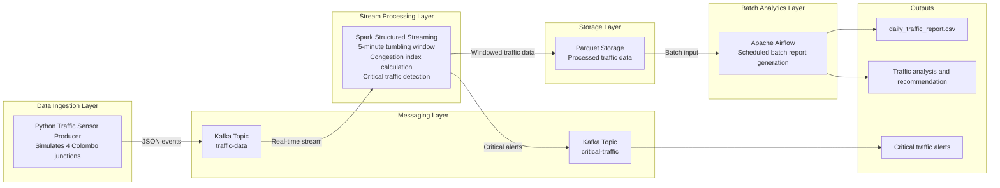

# Smart City Traffic & Congestion System for Colombo

## Overview

This project is a mini Big Data Engineering solution developed for an Applied Big Data Engineering module. It simulates urban traffic conditions in Colombo and demonstrates how a modern data pipeline can support real-time congestion monitoring, alert generation, and batch reporting.

The system follows a Lambda/Kappa-style approach:

- A real-time streaming path ingests and processes live traffic events
- A batch analytics path generates summary reports for decision-making

The project uses:

- Python for traffic data simulation
- Apache Kafka for message streaming
- Spark Structured Streaming for real-time processing
- Parquet files for processed data storage
- Apache Airflow for scheduled batch reporting
- Docker Compose for environment orchestration

## Project Scenario

The scenario models a Smart City Traffic and Congestion Monitoring System for Colombo. Traffic sensors are simulated at four major junctions:

- Borella
- Rajagiriya
- Pettah
- Nugegoda

Each sensor publishes traffic events containing:

- `sensor_id`
- `junction_name`
- `event_time`
- `vehicle_count`
- `avg_speed`

The goal is to detect heavy congestion, identify critical traffic conditions, store processed data, and produce a report that can help city authorities decide whether intervention is needed.

## Objectives

- Simulate live traffic sensor data from multiple Colombo junctions
- Stream traffic events to Kafka in JSON format
- Process the stream using Spark Structured Streaming
- Detect critical traffic conditions when average speed drops below `10 km/h`
- Store processed traffic results in a simple persistent layer
- Run scheduled analytics using Airflow
- Generate a CSV report for traffic analysis and recommendations

## System Architecture

The end-to-end architecture is shown below.



## Technology Stack

| Component | Technology | Purpose |
|---|---|---|
| Data Producer | Python | Simulates traffic sensor events |
| Stream Broker | Apache Kafka | Handles real-time event ingestion |
| Stream Processing | Spark Structured Streaming | Processes traffic events in real time |
| Storage | Parquet | Stores processed traffic results |
| Workflow Scheduling | Apache Airflow | Runs batch analytics and reporting |
| Containerization | Docker Compose | Runs the full platform locally |

## Folder Structure

```text
Big_Data_Mini_Project/
├── producers/
│   └── traffic_producer.py
├── spark_jobs/
│   └── traffic_streaming.py
├── dags/
│   └── daily_traffic_report_dag.py
├── data/
│   ├── checkpoints/
│   ├── processed/
│   └── sample_messages.jsonl
├── reports/
│   ├── daily_traffic_report.csv
│   └── daily_traffic_report_sample.csv
├── docker-compose.yml
├── requirements.txt
└── README.md
```

## Data Flow Description

### 1. Traffic Data Simulation

The Python producer simulates traffic sensors from the four selected Colombo junctions. It continuously sends JSON traffic events to the Kafka topic `traffic-data`.

Some events are intentionally generated as critical events by assigning an average speed below `10 km/h`.

### 2. Kafka Message Streaming

Kafka acts as the messaging layer of the system.

- Topic `traffic-data` stores incoming traffic events
- Topic `critical-traffic` stores critical alerts generated by Spark

### 3. Stream Processing with Spark

The Spark Structured Streaming job:

- reads events from `traffic-data`
- parses JSON records into structured columns
- uses `event_time` as the event timestamp
- applies a `5-minute` tumbling window
- calculates `congestion_index = vehicle_count / avg_speed`
- identifies critical events when `avg_speed < 10`
- writes normal processed traffic results to Parquet
- sends critical alerts to Kafka topic `critical-traffic`

### 4. Storage Layer

Processed traffic data is stored in Parquet format inside the `data/processed/traffic_windows/` directory. This keeps the implementation simple, lightweight, and easy to demonstrate.

### 5. Batch Reporting with Airflow

The Airflow DAG reads the stored processed traffic data and performs batch analysis by:

- aggregating traffic by junction and hour
- identifying the peak traffic hour for each junction
- calculating summary measures
- generating a CSV report with a recommendation column

Note:

The current implementation is scheduled hourly for easier demonstration during project evaluation. It can be changed to a daily schedule if required by the module guidelines.

## Message Format

Each traffic event published to Kafka uses the following JSON structure:

```json
{
  "sensor_id": "COL-001",
  "junction_name": "Borella",
  "event_time": "2026-05-09T14:00:00+00:00",
  "vehicle_count": 88,
  "avg_speed": 24.5
}
```

## Key Processing Logic

### Real-Time Logic

- Normal traffic events are aggregated in 5-minute windows
- Congestion index is calculated for traffic severity analysis
- Critical traffic is detected when `avg_speed < 10 km/h`

### Batch Logic

- Processed traffic data is grouped by junction and hour
- The hour with the highest traffic volume is identified
- A recommendation is added as either `Traffic police intervention needed` or `Normal monitoring is enough`

## Expected Outputs

The project produces the following outputs:

- Real-time traffic events in Kafka topic `traffic-data`
- Critical alerts in Kafka topic `critical-traffic`
- Processed Parquet files in `data/processed/traffic_windows/`
- Batch report in `reports/daily_traffic_report.csv`

## Sample Output

### Sample Input Events

Sample events are available in [data/sample_messages.jsonl](/Users/darshanamahesh/Desktop/Big_Data_Mini_Project/data/sample_messages.jsonl).

### Sample CSV Report

```csv
junction_name,hour_of_day,peak_vehicle_count,average_speed,average_congestion_index,recommendation
Borella,14,420,21.6,4.38,Normal monitoring is enough
Nugegoda,14,505,13.4,9.11,Traffic police intervention needed
Pettah,14,468,18.7,6.42,Normal monitoring is enough
Rajagiriya,14,544,9.8,12.85,Traffic police intervention needed
```

## How to Run the Project

### Prerequisites

- Docker Desktop installed and running
- Docker Compose installed
- At least 6 GB of memory available for Docker is recommended

### Step 1. Start the Platform

```bash
docker compose up -d
```

If you need a clean restart:

```bash
docker compose down -v
docker compose up -d
```

### Step 2. Verify Running Services

```bash
docker compose ps
```

Expected services:

- `zookeeper`
- `kafka`
- `producer`
- `spark-master`
- `spark-worker`
- `airflow-webserver`
- `airflow-scheduler`

### Step 3. Run the Traffic Producer

```bash
docker compose exec producer python /opt/project/producers/traffic_producer.py
```

This command starts the simulation and continuously sends traffic events to Kafka.

### Step 4. Start the Spark Streaming Job

Open another terminal and run:

```bash
docker compose exec spark-master /opt/spark/bin/spark-submit \
  --master spark://spark-master:7077 \
  --conf spark.jars.ivy=/tmp/.ivy2 \
  --packages org.apache.spark:spark-sql-kafka-0-10_2.12:3.5.1 \
  /opt/project/spark_jobs/traffic_streaming.py
```

This command starts the real-time Spark processing job.

### Step 5. Open Airflow

Airflow UI:

```text
http://127.0.0.1:8088/home
```

Login:

```text
Username: admin
Password: admin
```

From the Airflow interface, trigger the DAG `daily_traffic_report_dag`.

### Step 6. Check Critical Alerts

```bash
docker compose exec kafka kafka-console-consumer.sh \
  --bootstrap-server kafka:9092 \
  --topic critical-traffic \
  --from-beginning
```

This shows traffic alerts where average speed has fallen below the threshold.

### Step 7. View the Final Report

```bash
cat reports/daily_traffic_report.csv
```

## Important Files and Output Locations

| Item | Location |
|---|---|
| Traffic producer | `producers/traffic_producer.py` |
| Spark streaming job | `spark_jobs/traffic_streaming.py` |
| Airflow DAG | `dags/daily_traffic_report_dag.py` |
| Sample input data | `data/sample_messages.jsonl` |
| Processed traffic data | `data/processed/traffic_windows/` |
| Spark checkpoints | `data/checkpoints/` |
| Final report | `reports/daily_traffic_report.csv` |


## Example Interpretation of Results

- A high vehicle count with low average speed indicates heavy congestion
- A high congestion index shows that traffic flow is inefficient
- If average speed is very low, the system flags the location as critical
- The report recommendation helps identify whether traffic police intervention is needed

## Limitations

- The producer uses simulated data rather than real traffic sensor feeds
- The current reporting DAG is scheduled hourly for demonstration purposes
- The project runs in a local Docker environment and is not optimized for production scale
